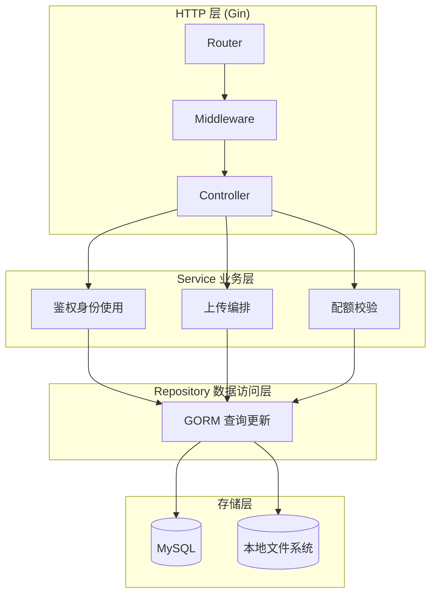

<p align="center">
  <b>GoNetDisk</b>
</p>

<p align="center">
  <b>基于 Go 的轻量级网盘后端服务</b>
</p>

<p align="center">
  
  
  
  
  
</p>

---

GoNetDisk 是一套最小可用的网盘后端，已实现用户体系、JWT 鉴权（含用户状态回查）、单文件上传、文件列表、基础单文件下载、文件哈希去重、目录创建和基础配额累加。前端页面已实现完整的文件管理界面，支持目录导航、面包屑、视图切换等功能。

## 当前能力

- 用户注册 / 登录
- JWT Token 鉴权（token 校验后回查 `user.status`，禁用用户禁止访问）
- 获取 / 更新当前用户信息
- 单文件上传（MD5 去重、配额检查）
- 单文件下载（按 `userfile_id`，支持 `Content-Type` 推断和 UTF-8 文件名）
- 文件/目录列表（支持分页、排序）
- 物理文件 MD5 去重
- 基础目录创建（返回 `folder_id`）
- 用户已用空间累计
- Docker 启动 MySQL 开发环境
- 完整 React 前端页面（目录导航、面包屑、上传下载、视图切换）
- 回收站功能（文件/文件夹删除、列表、还原）

## 架构


## 项目结构

```text
GoNetDisk/
├── cmd/server/              # 服务入口
├── configs/                 # 配置结构和 YAML
├── internal/
│   ├── controller/          # HTTP 控制器
│   ├── dto/                 # 请求/响应 DTO
│   ├── middleware/          # JWT 与 CORS 中间件
│   ├── model/               # GORM 模型
│   ├── repository/          # 数据访问层
│   ├── router/              # 路由装配
│   ├── service/             # 业务逻辑
│   └── util/                # JWT 等工具
├── pkg/database/            # 数据库初始化
├── front/                   # React 前端页面
├── docker/                  # MySQL Docker 配置
├── storage/temp/            # 临时上传目录
├── storage/uploads/         # 正式文件目录
└── ai-docs/                 # AI 协作文档
```

## 技术栈

| 类别 | 技术 |
|------|------|
| 语言 | Go 1.25.1 |
| Web 框架 | Gin 1.11.0 |
| ORM | GORM 1.31.1 |
| 数据库 | MySQL 8.0 |
| 配置 | Viper 1.21.0 |
| 认证 | golang-jwt/jwt/v5 5.3.0 |
| 密码哈希 | bcrypt |
| 前端 | React + Vite |

## 快速开始

### 环境要求

- Go 1.25.1+
- Node.js 16+ (for frontend)
- MySQL 8.0+，或 Docker

### 1. 启动数据库

```bash
cd docker
docker-compose up -d
```

默认会创建 `gonetdisk` 数据库并执行 `docker/init/init.sql`。

### 2. 检查配置

编辑 `configs/config.yaml`：

```yaml
server:
  port: 9090
  host: "0.0.0.0"
  mode: debug

database:
  host: "localhost"
  port: 3306
  user: "root"
  password: "gonetdisk"
  name: "gonetdisk"
  charset: "utf8mb4"
  parseTime: true
  loc: "Local"

jwt:
  secret: "your-secret-key"
  expiresHours: 24

storage:
  tempDir: "./storage/temp"
  uploadDir: "./storage/uploads"

upload:
  maxFileSizeMB: 100
```

配置加载采用三级策略：`CONFIG_PATH` 环境变量 → 可执行文件同级 `configs/config.yaml` → 当前工作目录 `configs/config.yaml`。存储路径会在加载后自动解析为绝对路径。

### 3. 启动后端服务

```bash
go run cmd/server/main.go
```

默认监听地址：`http://localhost:9090`

启动时会打印配置文件路径、存储目录、运行模式和监听地址。

### 4. 启动前端开发服务器

```bash
cd front
npm install
npm run dev
```

前端默认监听 `http://localhost:5173`，并已配置代理到后端 `http://localhost:9090`。

### 5. 局域网访问与上传

服务端当前按 `0.0.0.0:9090` 监听，因此同一局域网内的其他机器可以直接访问这个后端。

接入步骤：

1. 在服务端机器执行 `ipconfig`，确认局域网 IPv4 地址，例如 `192.168.1.50`。
2. 确认操作系统防火墙已经放行 TCP `9090` 入站。
3. 客户端把请求地址从 `http://localhost:9090` 改成 `http://192.168.1.50:9090`。
4. 浏览器客户端可以直接发起跨域上传请求；服务端已经放行 `Authorization`、`Content-Type` 和 `multipart/form-data` 预检请求。

### 6. 编译基线校验

当前仓库没有测试文件，但可以先做一次编译链路校验：

```powershell
$env:GOCACHE = (Join-Path $PWD '.gocache')
go build ./...
```

## API

基础前缀：`/api/v1`

### 用户模块

| 方法 | 路径 | 说明 | 认证 |
|------|------|------|:----:|
| POST | `/user/register` | 注册 | 否 |
| POST | `/user/login` | 登录 | 否 |
| GET | `/user/info` | 获取当前用户信息 | 是 |
| PUT | `/user/info` | 更新当前用户信息 | 是 |

### 文件模块

| 方法 | 路径 | 说明 | 认证 |
|------|------|------|:----:|
| POST | `/file/upload` | 上传文件 | 是 |
| GET | `/file/download/:userfile_id` | 下载文件 | 是 |
| DELETE | `/file/delete/:userfile_id` | 删除文件到回收站 | 是 |
| GET | `/file/list` | 获取文件列表 | 是 |

上传接口使用 `multipart/form-data`：

- `file`: 必填，上传文件
- `parent_id`: 选填，父目录 ID，根目录传 `0`

上传响应返回 `userfile_id`、`file_name`、`file_ext`、`file_size`、`parent_id`，不返回下载 URL。下载需通过 `GET /file/download/:userfile_id` 单独调用。

文件列表接口支持以下参数：

- `parent_id`: 父目录 ID，根目录传 `0`
- `page`: 页码，默认 1
- `page_size`: 每页数量，默认 5，最大 100
- `sort_by`: 排序字段，可选 `file_name`、`file_size`、`created_at`、`updated_at`，默认 `updated_at`
- `order_by`: 排序方向，可选 `asc`、`desc`，默认 `desc`

### 文件夹模块

| 方法 | 路径 | 说明 | 认证 |
|------|------|------|:----:|
| POST | `/folder/create` | 创建文件夹 | 是 |
| DELETE | `/folder/delete/:userfolder_id` | 删除文件夹到回收站 | 是 |

创建文件夹请求支持 JSON 或表单：

- `folder_name`: 必填，文件夹名
- `parent_id`: 选填，父目录 ID，根目录传 `0`

创建成功后返回新文件夹的 `folder_id`。

### 回收站模块

| 方法 | 路径 | 说明 | 认证 |
|------|------|------|:----:|
| GET | `/trash/list` | 获取回收站列表 | 是 |
| POST | `/trash/file/:userfile_id` | 还原文件 | 是 |
| POST | `/trash/folder/:userfolder_id` | 还原文件夹 | 是 |

回收站列表接口支持以下参数：

- `page`: 页码，默认 1
- `page_size`: 每页数量，默认 5，最大 100

## 前端功能

前端已实现完整的文件管理界面：

- 用户登录/注册
- 用户信息查看与修改
- 目录导航（面包屑）
- 文件/文件夹列表（网格视图/列表视图）
- 创建文件夹
- 上传文件（含进度显示）
- 下载文件
- 视图模式切换

## 请求示例

### 注册

```bash
curl -X POST http://localhost:9090/api/v1/user/register \
  -H "Content-Type: application/json" \
  -d '{"username":"test","email":"test@example.com","password":"123456"}'
```

### 登录

```bash
curl -X POST http://localhost:9090/api/v1/user/login \
  -H "Content-Type: application/json" \
  -d '{"email":"test@example.com","password":"123456"}'
```

### 上传文件

```bash
curl -X POST http://localhost:9090/api/v1/file/upload \
  -H "Authorization: Bearer <your-token>" \
  -F "parent_id=0" \
  -F "file=@/path/to/photo.jpg"
```

如果从局域网其他机器访问，只需要把 `localhost` 替换成服务端机器的局域网 IP。

### 下载文件

```bash
curl -O -J http://localhost:9090/api/v1/file/download/<userfile_id> \
  -H "Authorization: Bearer <your-token>"
```

### 获取文件列表

```bash
curl -X GET "http://localhost:9090/api/v1/file/list?parent_id=0&page=1&page_size=20" \
  -H "Authorization: Bearer <your-token>"
```

### 创建文件夹

```bash
curl -X POST http://localhost:9090/api/v1/folder/create \
  -H "Authorization: Bearer <your-token>" \
  -H "Content-Type: application/json" \
  -d '{"folder_name":"docs","parent_id":0}'
```

## 数据设计

当前 Go 代码实际迁移和使用的核心表有三张：

- `user`
- `physical_file`
- `user_file`

设计要点：

- `physical_file` 负责物理文件元数据和去重
- `user_file` 负责用户目录视图
- 相同内容的文件只存一份物理文件，通过 `file_hash` 复用
- 当前摘要算法为 `md5`

`docker/init/init.sql` 里还存在 `role`、`admin`、`permission`、`role_permission` 表草案，但当前没有对应的 Go 实现。

## 当前可优化问题

- 下载 `os.Open` 失败（磁盘文件缺失）仍统一返回 500，未区分 404
- 未支持的 `storage_type` 返回 500 而非 501
- 上传缺少文件名净化、MIME 白名单和内容级校验
- 配额不足时错误文案返回 `空间不足：<nil>`
- 超限错误文案仍写死"超过 100MB"，未反映实际配置值
- `GetSpace` 查询条件错误且当前未被使用
- 缺少文件重命名、移动接口
- 仓库没有自动化测试

## 开发路线

- [x] 用户注册 / 登录
- [x] JWT 鉴权
- [x] 用户状态校验（`user.status` 接入登录与鉴权）
- [x] 统一用户错误模型（400/401/403/404/409/500）
- [x] 文件上传
- [x] 文件哈希去重
- [x] 文件夹创建
- [x] 文件下载
- [x] 文件列表
- [x] 配置加载收口（三级策略 + 绝对路径解析）
- [x] 上传/下载契约定稿
- [x] 下载响应头改进（Content-Type 推断 + UTF-8 文件名）
- [x] AutoMigrate 错误检查
- [x] 前端完整 UI 实现
- [x] 回收站
- [ ] 文件重命名
- [ ] 文件移动
- [ ] 文件分享
- [ ] 文件预览
- [ ] 文件同步
- [ ] 完整存储管理
- [ ] 管理后台

## License

MIT

---

*最后更新：2026-04-15*